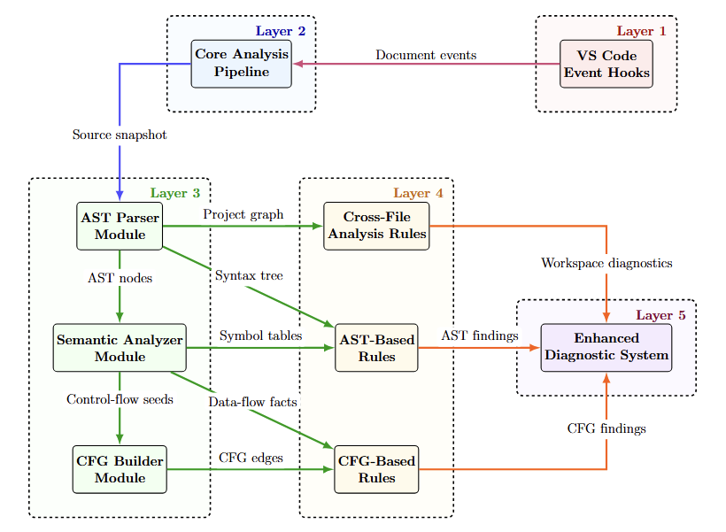

# Solidify - Real-Time Static Analysis for Solidity

**Solidify** là một công cụ phân tích tĩnh mã nguồn (Static Analysis Tool) dành cho ngôn ngữ Solidity, được tích hợp trực tiếp vào Visual Studio Code. Dự án được thiết kế với triết lý **"Real-time Security"** (Bảo mật thời gian thực), giúp lập trình viên phát hiện các lỗ hổng bảo mật và lỗi cú pháp ngay lập tức khi đang gõ code, thay vì phải chờ đợi quá trình biên dịch hay CI/CD pipeline.

---

## Mục Lục

1. [Giới Thiệu & Tầm Nhìn](#giới-thiệu--tầm-nhìn)
2. [Kiến Trúc Hệ Thống](#kiến-trúc-hệ-thống)
    - [Mô hình 5 Lớp](#mô-hình-5-lớp)
    - [Chiến lược Hybrid](#chiến-lược-lai)
3. [Phân Tích Chi Tiết Các Mô-đun](#phân-tích-chi-tiết-các-mô-đun)
    - [Core Engine](#1-core-engine-solidityanalyzerts)
    - [Security Module](#2-security-module-securityts)
    - [Semantic & AST Module](#3-semantic--ast-module-semanticts)
    - [Unused Variable Module](#4-unused-variable-module-unusedts)
    - [Syntax & Pragma Modules](#5-syntax--pragma-modules)
4. [Hiệu Năng & Thực Nghiệm](#hiệu-năng--thực-nghiệm)
5. [Hướng Dẫn Sử Dụng](#hướng-dẫn-sử-dụng)
6. [Hạn Chế & Hướng Phát Triển](#hạn-chế--hướng-phát-triển)
7. [Tuyên Bố Miễn Trừ Trách Nhiệm](#tuyên-bố-miễn-trừ-trách-nhiệm)
8. [Giấy Phép](#giấy-phép)

---

## Giới Thiệu & Tầm Nhìn

Hợp đồng thông minh (Smart Contract) một khi đã triển khai lên Blockchain thì không thể sửa đổi. Một lỗ hổng nhỏ cũng có thể dẫn đến thiệt hại hàng triệu đô la. Các công cụ truyền thống như **Slither** hay **Mythril** rất mạnh mẽ, nhưng chúng hoạt động theo cơ chế **Offline/Batch** - tức là phải viết code xong, chạy lệnh, và chờ đợi kết quả.

**Solidify** sinh ra để lấp đầy khoảng trống đó. Chúng tôi mang khả năng phân tích bảo mật vào ngay trong IDE. Mục tiêu của Solidify không phải là thay thế Audit chuyên sâu, mà là đóng vai trò làm lớp phòng thủ đầu tiên, giúp dev sửa lỗi ngay khi ý tưởng vừa được chuyển thành dòng code.

---

## Kiến Trúc Hệ Thống

Dự án được xây dựng dựa trên kiến trúc 5 lớp (5-Layer Architecture) độc lập, tối ưu hóa cho tốc độ phản hồi (Latency) cực thấp.

### Mô hình 5 Lớp

1.  **Layer 1: VS Code Integration**
    *   **Nhiệm vụ:** Là cầu nối giữa VS Code và bộ phân tích.
    *   **Kỹ thuật:** Sử dụng `vscode.workspace.onDidChangeTextDocument` với cơ chế **Debounce** (độ trễ 300ms) để tránh phân tích quá tải khi người dùng gõ liên tục.
    *   **Output:** Quản lý `DiagnosticCollection` để hiển thị gạch chân đỏ/vàng ngay trong editor.

2.  **Layer 2: Core Analysis Engine**
    *   **Nhiệm vụ:** Nhạc trưởng điều phối toàn bộ quá trình. Nó nhận nội dung thô, quyết định xem nên dùng Regex hay AST, và gọi các Rule Engine tương ứng.
    *   **Kỹ thuật:** Xử lý `Tree-sitter` parser initialization, quản lý bộ nhớ đệm cho các AST nodes để tái sử dụng.

3.  **Layer 3: AST/CFG Processing**
    *   **Nhiệm vụ:** Hiểu cấu trúc code.
    *   **Kỹ thuật:** Sử dụng **Tree-sitter** (`tree-sitter-solidity`) thay vì bộ parser của trình biên dịch `solc`.
    *   **Tại sao là Tree-sitter?** `solc` rất chậm và chỉ hoạt động khi code đúng cú pháp hoàn toàn. `Tree-sitter` có khả năng **Incremental Parsing** (phân tích gia tăng) và chịu lỗi tốt (error tolerance) - nó vẫn có thể dựng cây AST ngay cả khi đang gõ dở dang và thiếu dấu `;`.

4.  **Layer 4: Modular Rules Engine**
    *   **Nhiệm vụ:** Chứa logic nghiệp vụ của từng quy tắc kiểm tra. Các rules được tách biệt hoàn toàn, giúp dễ dàng thêm mới hoặc bảo trì.

5.  **Layer 5: Diagnostic Display**
    *   **Nhiệm vụ:** Hiển thị kết quả cho người dùng (Problems Panel, Inline Squirrles, Quick Fixes).

  

### Chiến lược Hybrid

Solidify không chỉ dựa vào AST. Để đạt tốc độ 82ms, chúng tôi sử dụng chiến lược **Hybrid**:
*   **Regex-based (Nhanh):** Dùng Regular Expressions cho các pattern đơn giản, cục bộ (ví dụ: tìm từ khóa `tx.origin`). Tốc độ thực thi gần như tức thì $O(n)$.
*   **AST-based (Sâu):** Dùng cây cú pháp trừu tượng cho các logic cần ngữ cảnh, ví dụ: "Biến này được khai báo ở đâu?", "Hàm này có visibility chưa?".

---

## Phân Tích Chi Tiết Các Mô-đun

Dưới đây là tài liệu kỹ thuật chi tiết cho từng component trong thư mục `src`.

### 1. Core Engine
Đây là file trung tâm. Logic hoạt động như sau:
*   B1: Nhận `activeTextEditor` content.
*   B2: Khởi tạo `Tree-sitter` parser (nếu chưa có).
*   B3: Dựng cây AST từ code.
*   B4: Thu thập danh sách các biến đã khai báo (`declaredIdentifiers`) và phạm vi của chúng để phục vụ việc kiểm tra biến chưa sử dụng.
*   B5: Chạy lần lượt các nhóm rules (Pragma -> Semantic -> Syntax -> Security).
*   B6: Tổng hợp kết quả `Finding[]` và trả về cho VS Code.

### 2. Security Module
Mô-đun này tập trung vào các lỗi bảo mật nghiêm trọng (High Severity).
*   **Kỹ thuật:** Chủ yếu dùng **Regex** để đảm bảo tốc độ tối đa cho các lỗi này.
*   **Các Quy Tắc (Rules):**
    *   **`TX_ORIGIN`:** Phát hiện sử dụng `tx.origin` để xác thực. (Kẻ tấn công có thể lừa contract bằng Phishing).
    *   **`SELFDESTRUCT`:** Phát hiện lệnh `selfdestruct` hoặc `suicide`. (Hợp đồng có thể bị hủy, tiền bị khóa vĩnh viễn hoặc bị lấy cắp).
    *   **`DELEGATECALL`:** Cảnh báo khi dùng `delegatecall`. (Rủi ro cao về thực thi code trong context của caller, dễ bị tấn công nếu context không sạch).
    *   **`LOW_LEVEL_CALL_VALUE`:** Phát hiện `.call{value: ...}`. (Dễ bị Reentrancy attack nếu không tuân thủ Checks-Effects-Interactions).

### 3. Semantic & AST Module
Mô-đun này thông minh hơn, "hiểu" được code thay vì chỉ nhìn mặt chữ.
*   **Kỹ thuật:** Duyệt cây **AST** (Abstract Syntax Tree). Sử dụng các helper như `findEnclosingFunction`, `findEnclosingContract`, `uintWidth`.
*   **Các Quy Tắc (Rules):**
    *   **`MISSING_VISIBILITY`**: Duyệt node `function_definition`, kiểm tra xem có child node `visibility` không. Nếu không -> Báo lỗi (Mặc định Solidity cũ là public, rất nguy hiểm).
    *   **`UNSAFE_ADDRESS_CAST`**: Phát hiện ép kiểu từ `address` sang số nguyên nhỏ hơn 160-bit (ví dụ `uint32(msg.sender)`). Logic: Parse `primitive_type` để lấy độ rộng bit, so sánh với 160.
    *   **`DEPRECATED_THIS_BALANCE`**: Tìm node `member_expression` dạng `this.balance`. Cảnh báo thay bằng `address(this).balance`.
    *   **`MSG_SENDER_TRANSFER`**: Kiểm tra việc gọi `.transfer()` trên `msg.sender` mà không ép kiểu `payable`.
    *   **`LOW_LEVEL_CALL_NO_DATA`**: Các lệnh `.call()` cấp thấp phải luôn có tham số data (hoặc `""`).
    *   **`UNCHECKED_LOW_LEVEL_CALL`**: Kiểm tra xem giá trị trả về (bool success) của `.call` có được xử lý hay không. Nếu `call` được dùng trong `expression_statement` mà không gán vào biến nào -> Báo lỗi.

### 4. Unused Variable Module
Một trong những module phức tạp nhất về mặt thuật toán.
*   **Bài toán:** Làm sao biết một biến đã khai báo nhưng không bao giờ được đọc?
*   **Giải thuật:**
    1. Core engine thu thập tất cả `DeclaredDecl` (Tên biến, vị trí, node cha/scope).
    2. Phân loại biến: `State Variable` (biến toàn cục), `Parameter` (tham số hàm), `Local` (biến cục bộ).
    3. Với mỗi biến, thực hiện `findUsageInScope(scopeNode, varName)`:
        *   Duyệt đệ quy trong `scopeNode` (ví dụ: thân hàm).
        *   Tìm các node `identifier` trùng tên.
        *   Loại trừ: Các trường hợp biến nằm ở vế trái của phép gán (`x = 10` không được tính là "sử dụng" giá trị của `x`).
    4. Nếu không tìm thấy usage -> Báo Warning "Unused variable".
*   **Ngoại lệ:** Tự động bỏ qua các biến bắt đầu bằng `_` (quy ước biến dự phòng) hoặc các hàm abstract không có body.

### 5. Syntax & Pragma Modules
*   **`syntax.ts`**: Kiểm tra cái lỗi ngớ ngẩn như thiếu dấu chấm phẩy (`;`), thiếu ngoặc đơn `()`, thiếu từ khóa `return` trong hàm có returns. Kết hợp cả Regex (quét cuối dòng) và AST (để biết đang ở trong function nào).
*   **`pragma.ts`**: Đảm bảo file có khai báo `SPDX-License-Identifier` và `pragma solidity`.

---

## Hiệu Năng & Thực Nghiệm

Chúng tôi đã thực hiện benchmark trên tập dữ liệu 300 Smart Contracts thực tế.

| Metrics | Solidify | Compiler-based of Blanco |
| :--- | :--- | :--- |
| **Latency** | ~538 ms | ~2447 ms |
| **Cơ chế** | Incremental AST + Regex | Full Compilation |
| **Thời điểm phản hồi** | Ngay khi gõ | Khi lưu |

Solidify nhanh hơn **~4.5 lần** so với các công cụ truyền thống nhờ việc loại bỏ bước biên dịch nặng nề và sử dụng Tree-sitter được viết bằng C++ (binding sang Node.js).

---

## Hướng Dẫn Sử Dụng

Vì extension hiện đang trong giai đoạn phát triển và nghiên cứu, mọi người có thể sử dụng Solidify theo hai cách sau:

### Cách 1: Sử dụng bộ cài đặt (.vsix)
Nếu muốn áp dụng Solidify vào môi trường VS Code:
1. Tải file `solidity-static-analyzer-0.0.1.vsix` từ repository.
2. Mở VS Code, đi tới tab **Extensions** (`Ctrl+Shift+X`).
3. Click vào biểu tượng **...** (Views and More Actions) ở góc trên bên phải.
4. Chọn **Install from VSIX...** và trỏ tới file vừa tải về.
5. Sau khi cài đặt, extension sẽ tự động kích hoạt khi mở một file `.sol`.

### Cách 2: Chạy trong môi trường Debug
Nếu muốn tạo 1 cửa sổ riêng để debug extension:
1. Mở project bằng VS Code.
2. Nhấn **F5** (hoặc tab Debug -> Start Debugging).
3. Một cửa sổ **Extension Development Host** mới sẽ hiện ra. Tại đây, extension Solidify đã được tải và sẵn sàng sử dụng.

---

## Hạn Chế & Hướng Phát Triển

### Hạn Chế Hiện Tại
*   Quy trình phân phối hiện tại mới chỉ dừng lại ở việc tạo file cài đặt thủ công (`.vsix`).
*   Chưa được tích hợp chính thức lên VS Code Marketplace để tìm kiếm và cài đặt tự động.

### Hướng Phát Triển Tương Lai
*   **Marketplace Integration:** Hoàn thiện các tiêu chuẩn bảo mật và metadata để publish extension lên VS Code Marketplace chính thức, giúp người dùng dễ dàng search và install.
*   **Security Updates:** Cập nhật thêm nhiều rule engine mới cho các lỗ hổng bảo mật DeFi mới nổi.
*   **Quick Fixes:** Bổ sung tính năng tự động sửa lỗi (Auto-fix) cho các lỗi cú pháp đơn giản.

---

## Tuyên Bố Miễn Trừ Trách Nhiệm

Công cụ này được phát triển hoàn toàn cho mục đích **nghiên cứu và học tập**. Tác giả không chịu bất kỳ trách nhiệm nào đối với:
*   Bất kỳ thiệt hại về tài sản, dữ liệu hoặc bảo mật nào phát sinh từ việc sử dụng công cụ này.
*   Việc sử dụng công cụ này vào các mục đích xấu, tấn công hoặc khai thác lỗ hổng bất hợp pháp.
*   Các sai sót trong kết quả phân tích (công cụ có thể có False Positives hoặc False Negatives).

Người dùng tự chịu trách nhiệm hoàn toàn khi sử dụng công cụ này trên các mã nguồn thực tế hoặc môi trường Mainnet.

---

## Giấy Phép

Dự án này được phát hành dưới giấy phép **MIT License**. Mọi người có quyền tự do sử dụng, sao chép, sửa đổi và phân phối lại mã nguồn này theo các điều khoản của giấy phép. Xem chi tiết tại [LICENSE](LICENSE).

---
